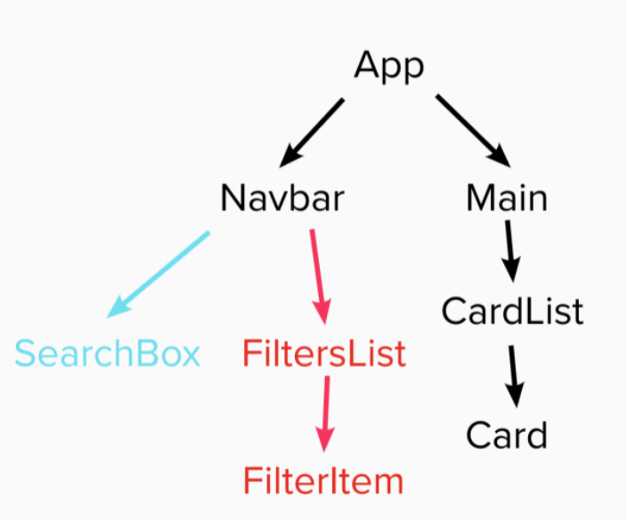
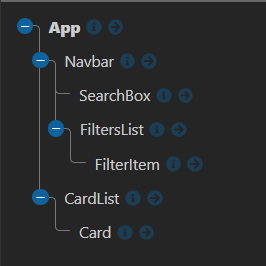

# Feedback

Hey Charlie here, feel free to message me on Slack if you want any clarification on the points below. I will give you both positive and constructive feedback on your project.

---

## Requirements

- Should be built in React - DONE
- Use the Punk API (after using the data file first) - DONE
- Test where possible (RTL) - NOT DONE
  - Covered later on course so no time to implement, when you have time give it a go.
- Repository on GitHub - DONE

### Start

> "All the wireframe content in black is the first part of the challenge - that is, the sidenav, the main section containing the beers and beer cards for each piece of data. The component tree is below to help you get started."

Below I have the component tree from the brief and your component tree.





You are missing the `<Main/>` component. I understand that it may seem overkill and it probably is with an application this size. The reason why is to force you to create components pass data with props. It is important to understand that you can get props through multiple components. From the App -> Main -> CardList -> Card.

I am confident with your understanding of props as you have demonstrated it getting values from the `<App/>` to the `<FilterItem/>`.

When you have some time try introducing the `<Main/>` component.

One exercise you might benefit from is to start thinking what is a component and what is a container?

### Extension 1

> Once you've got the design and layout sorted to render the elements, it's time to add some search functionality. Make it so you can search the beers by their name, and the page content should update as you type each letter in the box.

The aim of this extension is to get you using functions as props. You have smashed it, `handleInput()` in your app is being passed multiple component levels to your search component. That component is using the function to capture the user input and storing it in the App state. You are then able to use the value to filter the beers you get back from the API. This is great!

There is an alternative way of doing this, this is with query params. On the docs it has `beer_name` which you can append to the url with a name you want to search. As you are doing the some of the filtering with query params as an extension why not try and implement search with this?

```jsx
// App.jsx
// getBeers()
if (searchTerm) queryParameter += "?beer_name=" + "WHAT WOULD THE VALUE BE EQUAL TO?";
```

### Extension 2

> Finally attempt to make it so you can filter the content on three conditions:
>
> - High Alcohol (ABV value greater than 6%)
> - Classic Range (Was first brewed before 2010)
> - High Acidity (pH lower than 4)

Nice going with this I can see you are updating your api URL with the correct params to get by abv and by classic range.

To do so you are using functions as props, your handleChange() takes the event which you use to toggle state, so you know which filter you need to apply. These toggles default state should be `false` not an empty string.

```jsx
// App.jsx
const [highAcidity, setHighAcidity] = useState(false);
const [highAlcohol, setHighAlcohol] = useState(false);
const [classicRange, setClassicRange] = useState(false);
```

Some points to tidy up your `useEffect()` and `getBeers()` are below. I have removed the console.log()s.

```jsx
// App.jsx
// YOUR USE EFFECT IS GREAT
// YOU ARE NOT USING highAcidity IN GET BEERS
// THIS ISN'T A DEPENDENCY IF YOU ARE NOT USING IT
useEffect(() => {
  getBeers(highAlcohol, classicRange);
}, [highAlcohol, classicRange]);

const baseUrl = "https://api.punkapi.com/v2/beers";
// MAKE SURE YOU USE THE ALL OF THE ARGUMENTS
const getBeers = async (highAlcohol, classicRange) => {
  let queryParameter = "";
  // THE URL CAN BE THE BASE URL FROM THE START
  let url = baseUrl;
  // THIS IS NICE AND CLEAR GOOD GOING :)
  //  -> IF TOGGLE IS TRUE ADD THE PARAM
  if (highAlcohol) {
    queryParameter += "?abv_gt=6";
  }

  if (classicRange) {
    // THIS COULD BE A TURNERY?
    queryParameter += queryParameter ? "&brewed_before=01-2010" : "?brewed_before=01-2010";
  }

  if (queryParameter) {
    url += queryParameter;
  }

  const response = await fetch(url);
  const data = await response.json();

  setBeers(data);
};
```

You can have a lot of filters in the app, which means you have different ways of rendering your `<CardList/>`.

This means you are looping through the same data three times when you could do this once.

```jsx
// App.jsx
const filteredBeers = beers.filter(beer => {
  let isMatch = beer.name.toLowerCase().includes(searchTerm.toLowerCase());

  if (isMatch && highAcidity) {
    isMatch = beer.ph < 4;
  }

  return isMatch;
});
```

This would mean you could remove all of the conditional renderings of the `<CardList/>` in your return and just have one.

### Extension 3

> Style the website however you see fit! Go wild!

Completed, it looks great :)

---

## The App

### Positive

- Great color's, shadows and borders
- It looks good on desktop, tablet and mobile.
  - Media queries are great!
- They stack at different screen sizes, Nice!
- You have all of the functionality that was requested.
- It is dynamic and responding to the user interacting with it.

### Constructive

- Get it hosted
- Give the project a title / logo / piece of text describing it
- Some of the cards text is quite large, do you think you could only display the first sentence?
  - The description will be a string, what methods can you use on a string?
- Update the readme.md with some Markdown. [Markdown in 10mins](https://www.markdowntutorial.com/)

---

## The Code

### Positive

- You have multiple functions being passed across your application to the components that need them.

- You are utilizing the power of conditional state & query params to apply your filters!.

  - With a couple of small tweaks mentioned above they work and are optimized.

- I feel confident with your understanding of props, useState, useEffect and funcs as props.

- Using BEM :)

- `<FilterList/>` Mapping over an array to create `<FilterItem/>` is awesome a very nice touch. If you wanted another filter add it to the array and create some state for it.

- Awesome good going! I can't wait to see what you build next.

### Constructive

You have some errors in the console:

- The first is related to what you are doing in the `<FilterList/>` component. You are going to need to add the key prop as you are creating multiples.

- The second is because you are using `for` instead of `htmlFor` on your `<FilterItem/>`. `for` is a reserved word in JS so you can not use it in the same that you can in HTML. This is similar to why we have to use `className` instead of `class`.

At the moment you are getting 25 beers. Did you know you can specify how many you to display with query params? The limit is 80.

---
